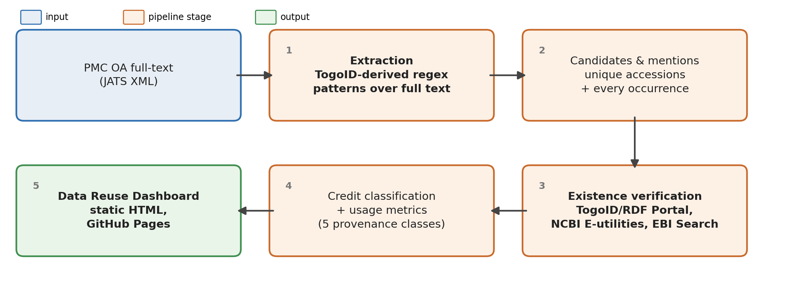
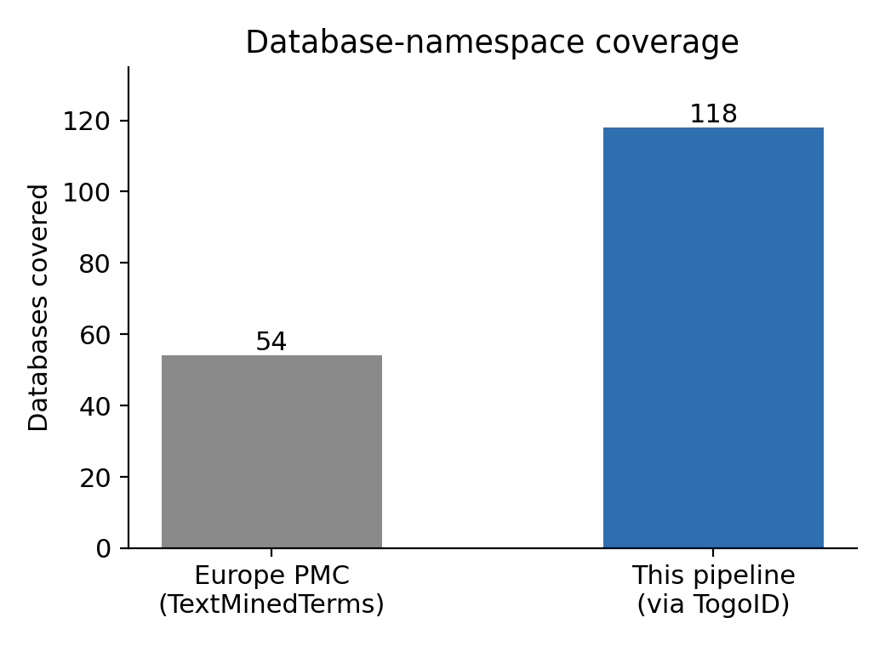
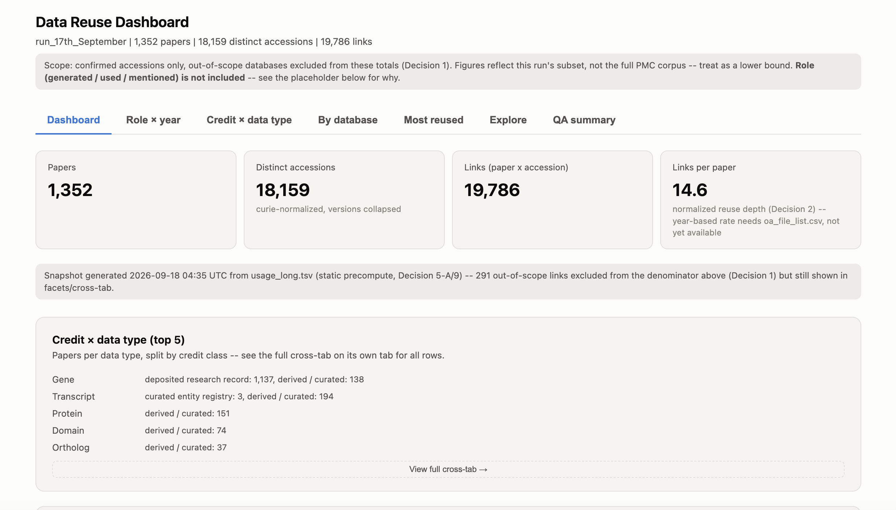

# Abstract

Funders and data producers need to know not just which databases are cited in the literature, but
whether a cited accession actually exists and how it was used. We report on a pipeline, built during
the DBCLS BioHackathon 2026, that extracts database identifiers from PMC full text, verifies each one
against source-of-truth APIs (TogoID/RDF Portal, NCBI E-utilities, EBI Search), and classifies
confirmed accessions into one of five credit/provenance classes. On a working slice of 10,896 PMC
documents, the pipeline confirms 19,786 (paper, accession) links across 1,352 papers and 18,159
distinct accessions, though a single namespace (`insdc`) accounts for roughly 70% of that volume. An
independent comparison against Europe PMC's own accession annotations over the same slice shows 74.6%
agreement at the individual-citation level, with a bimodal split at the per-document level: 64% of
documents that either system found anything in agree at 90-100%, while 16% agree at only 0-10%, a
pattern that needs manual citation and analysis. The pipeline, its Europe PMC comparison, and a static, backend-free
dashboard reporting the results are complete and reproducible for this slice. Doing manual curation for this small corpus, 
Extending coverage,  running against the full corpus, and adding reference-role (created/used/mentioned) classification are
left as future work.

# Introduction

Data producers and funding agencies increasingly need to know how deposited datasets are actually
reused in the published literature, and to know it at the level of individual database entries
(accessions), not merely which databases are cited. This project builds an open, reproducible,
regularly updated pipeline that extracts references to data entities from the full text of PMC Open
Access articles (~8 million article versions), verifies that each referenced identifier really
exists, and normalizes references at the entry level. The hackathon goal is create this pipeline,
harden the extraction and the identification layer, have a dashboard to showcase this information 
and also make a comparison between the existing EuorpePMC Annotations API and our pipeline and see
if there is any gaps we have uncovered. 

## Background and motivation

Europe PMC text-mines accession numbers from over 40 life-science databases and publishes them
weekly on its FTP/bulk-download site [@EuropePMCBulk2024], which is valuable and complementary to
this work. Since that publication, coverage has increased to currently ~54 data resources. The
programmatic form of these annotations is available through the Europe PMC Annotations API
[@EuropePMCAnnotationsAPI2024]. The corpus and access method this pipeline consumes roughly 8
million PMC article versions on the `pmc-oa-opendata` S3 bucket and are documented by NCBI
[@NCBIPMCAWS2026].

What is still missing across existing efforts is a combination of:

(1) a fully reproducible, openly specified extraction method

(2) entry-level normalization across databases (cross-referencing an
accession to a single canonical identity

(3) coverage of databases beyond the common deposition
archives (model-organism, ortholog, and other reference resources) 

(4) a distinction between reference *roles* -- data used, generated, or merely mentioned.

Identifiers.org is central to points (1)-(2): its registry (prefixes, patterns) and resolver define
the canonical namespaces that make entry-level identity possible. Our existence-verification layer
already relies on Identifiers.org-style URIs.

# Methods

This section describes what we built during the hackathon: the extraction-to-dashboard pipeline
itself (Figure \ref{pipelineArchFig}), how it is compared against Europe PMC's own annotations, and
the dashboard used to report the result.

## Pipeline architecture

Figure \ref{pipelineArchFig} shows the data flow in five stages: full-text extraction, candidate/
mention deduplication, existence verification, credit classification, and reporting.

{ width=460px }

Upstream inputs feeding this pipeline:

- **PMC OA full-text XML** addressed by shard via `shard_plan.json` (generated with
  `phase1_ner plan`).
- **`togoid_dataset.yaml`** -- upstream DBCLS input, fetched from `dbcls/togoid-config ->
  config/dataset.yaml`.
- **`rdf-config` repository** (`git clone https://github.com/dbcls/rdf-config`) -- input for the T2a
  registry.
- **Europe PMC** Annotations API / bulk dump, used as an independent comparison source, not as a
  dependency of extraction itself.

**Pipeline stages.** The pipeline proceeds through five stages.

**Stage 1 (extraction)** parses each JATS document with a
shared full-text parser and applies the TogoID-derived regex patterns [@Ikeda2022TogoID] (word-boundary anchored,
digit-floor gated) to passage text, producing per-shard tables of raw accession mentions with their
database, surface form, and text offset. No GPU is required, and each shard is processed
idempotently.

**Stage 2 (candidates and mentions)** deduplicates raw mentions into a unique `(database, surface)`
candidate set to be verified, while separately retaining every individual occurrence (with document
ID and offset) for downstream counting.

**Stage 3 (existence verification, T2 then T3)** checks each candidate against source-of-truth
registries in two tiers. T2 checks the TogoID label graph and rdf-config-native URIs against RDF
Portal via SPARQL. T3 then confirms or refutes against two authoritative source APIs, routed by
accession shape: NCBI E-utilities [@Sayers2010EUtilities]  (authoritative for RefSeq/GEO) and EBI Search [@Pearce2025EBISearch]. Each candidate ends this stage as
`confirmed`, `pending`, or `absent`.

**Stage 4 (metrics)** joins confirmed entries with their mentions and classifies each into one of five
credit/provenance classes (Table \ref{creditClassTable}).

Table: Credit/provenance classes assigned to each confirmed identifier. \label{creditClassTable}

| Class | Meaning |
| --- | --- |
| `deposited_research_record` | Primary research output deposited by the citing paper's own authors |
| `deposited_entity_registry` | Entity deposited in a registry as part of the described work |
| `curated_entity_registry` | Reference to a pre-existing, professionally curated registry entry |
| `derived_curated` | Reference to a derived/computed resource built on curated data |
| `out_of_scope` | Identifier-shaped string that does not represent an in-scope database citation |

These five classes aren't from a single existing standard; we put them together ourselves, but not
out of thin air. Two of the boundaries follow a distinction bioinformatics has used for decades:
some databases just hold data as researchers submitted it (GenBank, GEO, SRA), while others take
that raw data and curate or compute something new from it (UniProt, RefSeq, Pfam)
[@EBIPrimarySecondaryDB; @Galperin2015NARDatabase]. That maps onto our
`deposited_research_record`/`deposited_entity_registry` classes on one side and `derived_curated` on
the other.

`curated_entity_registry` (HGNC, ChEBI, OMIM) doesn't fit either side of that split, so we added it
as a third bucket. These aren't raw deposits, and nobody computed them from other data either, a
curator looked at the evidence and decided "this gene is called BRCA1" or "this molecule is ChEBI
12345." That's a judgment call about identity, not a deposit or a derivation.

**Stage 5 (reporting)** turns the resulting usage tables into the dashboard described under
Dashboard below.

This path is entirely separate from the concept/named-entity-recognition layer elsewhere in the
repository (a GPU-backed HunFlair2 pipeline for biomedical concepts such as genes, diseases,
organisms, and chemicals); the two share only the JATS full-text parser, and the path above needs no
GPU.

**Verification (T2/T3).** Every candidate identifier is checked against a live registry before being counted as confirmed. T3
verification was extended during the hackathon to route by accession shape across **two** independent
source APIs rather than one: NCBI E-utilities for RefSeq and GEO accessions, and **EBI Search** for
INSDC/ENA nucleotide accessions. Specifically, nucleotide- and protein-style INSDC accessions must be
routed to different services, protein accessions are not indexed under the `embl` domain EBI Search
uses for nucleotide records, so protein-shaped IDs are instead verified through NCBI's `efetch`
protein endpoint, while nucleotide-shaped IDs are confirmed against EBI Search directly. Adding EBI
Search as its own verification layer closed a gap where nucleotide accessions had previously been
under-verified through a domain mismatch.

Which route actually confirmed each link, on this run, is reported in Results §4 -- read directly
from this run's own dashboard data rather than from a separate benchmark.

## Comparison with Europe PMC

We independently compare pipeline output against Europe PMC's own accession annotations for the same
papers, rather than treating either pipeline's output as ground truth.

**Comparison method.** Europe PMC's accession annotations are fetched and normalized, mapping identifiers.org namespaces
to the pipeline's own dataset keys and aligning annotation offsets to the local PMC XML text and
then compared against this pipeline's own extraction output for the same documents. The comparison is
over unique (PMC article ID, dataset, literal accession) triples, repeated
mentions of the same accession within one article are not double-counted. Each triple is tagged
`both`, `togoid_only`, or `europepmc_only`, with database-level totals rolled up separately. These
outputs are also rendered into an Excel workbook with per-group worksheets (Summary, Both, Europe
PMC, TogoID, Comparison, TogoID only, Europe PMC only, Rejected review, Interpretation) and charts,
for reviewers who prefer a spreadsheet over raw TSVs.

Import-quality checks are part of the normal run: rejected annotation-alignments are grouped by
reason (an empty set on a fully aligned sample is the target), namespace-mapping ambiguities are
surfaced separately, and DOIs and other non-accession identifiers are intentionally excluded from
accession comparison rather than silently dropped.

**Complementarity, not overlap.**

Table: Europe PMC vs. this pipeline, on the axes that distinguish them.

| Axis | Europe PMC | This pipeline |
| --- | --- | --- |
| Core task | Text-mines full text for accessions + concepts (genes, diseases, organisms, chemicals) | Extracts accessions, then adds existence verification and role classification |
| Entry existence | Not verified -- an annotation says "this string looks like a GEO ID," not "this GEO record exists" | Verified against source (T2 TogoID/RDF Portal SPARQL; T3 NCBI E-utilities + EBI Search) -> confirmed/pending/absent |
| Reference role | Occurrence tags only -- no notion of who did what | Classifies role: created (deposited) / used (reused) / mentioned |
| Database coverage | ~54 databases, weekly, public API/FTP | ~118-119 via TogoID, entry-type-split (RefSeq/UniProt/SRA/GEO broken into sub-types) |
| Method/output openness | Fully public (Kafkas method; Annotations API; weekly dump) | Ingests EPMC's dump as a baseline input; layers verification + role classification on top |

{ width=380px }

Where each covers the other's blind spot is the key finding (Figure \ref{coverageFig}): **EPMC
covers what we currently miss** -- our biggest recall gap is exactly the EBI deposition databases
(ENA, PDB, PRIDE, MetaboLights, EMPIAR, EMDB, BioStudies, EGA, ArrayExpress, AlphaFold), which EPMC
extracts well. **We cover what EPMC misses** -- model-organism gene resources (FlyBase, MGI, RGD,
SGD, WormBase, ZFIN, TAIR), orthology (COG, HomoloGene, OMA), and Japan-origin resources (JGA, NBDC,
MBGD, TogoVar, GEA, NANDO). Downstream, EPMC's text-mined accessions already feed the DataCite / Make
Data Count Data Citation Corpus (its v4 ingested ~5.2M EPMC citations); this project sits above that
aggregation layer, contributing verified, role-typed entries rather than raw mentions. In one line:
EPMC answers "was this ID mentioned?"; this project answers "does the referenced dataset exist, and
was it created or reused?" -- the two coverage sets are complementary, not competing.

## Dashboard

The "create a webpage to showcase the data" hackathon task was completed as a static, backend-free
dashboard: a single self-contained HTML file with all data embedded inline and all filtering computed
client-side. On our current working snapshot it reports **1,352 papers**, **18,159 distinct
accessions** (curie-normalized, versions collapsed), **19,786 (paper, accession) links**, and **14.6
links per paper**, after excluding **291** out-of-scope links from the reporting denominator. It is
deployed as a static site via GitHub Pages, requiring no backend infrastructure to serve to
collaborators.

{ width=420px }

# Results

Every number below is read directly from a sample run's own output files -- the Data Reuse Dashboard's
data (`metrics/usage_long.tsv`, built by `build_data_reuse_dashboard.py`) and the Europe PMC
comparison matrix (`comparison/summary.json`, `comparison/by_database.tsv`,
`comparison/document_agreement_histogram.tsv`, built by `compare_extractions.py`). The run covers 10,896 planned documents ; this is
one working slice of PMC, not the full corpus, so nothing below should be read as a corpus-wide
estimate.

## 1. Pipeline output volume

After the confirmed/in-scope denominator (Decision 1): **1,352 papers** have at least one confirmed
accession, spanning **18,159 distinct accessions** (curie-normalized, versions collapsed) and
**19,786 (paper, accession) links** -- 14.6 links per paper on average. A further 291 links were
confirmed but classified `out_of_scope` and excluded from these totals (still visible in the
dashboard's facets).

## 2. Credit/provenance class breakdown

Table: Confirmed links by credit/provenance class, this run.

| Class | Papers | Accessions | Links |
| --- | --- | --- | --- |
| `deposited_research_record` | 1,164 | 13,121 | 13,950 |
| `derived_curated` | 484 | 5,024 | 5,822 |
| `curated_entity_registry` | 6 | 14 | 14 |
| `out_of_scope` (excluded above) | 26 | 212 | 291 |

`deposited_research_record` dominates -- about 70% of all links -- almost entirely because of one
database (below). `curated_entity_registry` is small in this run because few of the enabled
namespaces fall in that class (see the credit-class discussion under Methods).

## 3. Data type and database concentration

By data type, **Gene** accounts for 1,193 of 1,352 papers and 14,974 of 19,786 links (~76% of all
links); every other data type is a distant second (Transcript: 196 papers/2,258 links; Ortholog: 37
papers/858 links; Protein: 151 papers/820 links). Within Gene, a single database drives almost all of
it: **`insdc`** alone accounts for 1,137 papers and 13,768 links -- about **70% of every link in the
dataset** comes from one namespace. The next-largest databases are `refseq_rna` (187 papers, 2,095
links), `refseq_protein` (119 papers, 731 links), `refseq_genomic` (103 papers, 934 links), `pfam` (51
papers, 437 links), and `cog` (37 papers, 858 links). Any claim about "database diversity" in this run
has to be read against that concentration -- the long tail is real, but it is a small fraction of
total volume.

## 4. Verification route and confidence mix

Across all 20,077 confirmed links (before the out-of-scope exclusion in §1), the verification route
that confirmed each one splits: EBI Search (`ena_api`) 11,813 (58.8%), TogoID label graph
(`togoid_label`) 3,161 (15.7%), NCBI E-utilities (`ncbi_eutils`) 2,366 (11.8%), NCBI E-utilities
protein route (`ncbi_eutils_protein`) 1,511 (7.5%), rdf-config-native RDF (`rdfportal_native`) 771
(3.8%), and the Identifiers.org resolver (`idorg_resolution`) 455 (2.3%). Extraction confidence is
overwhelmingly `high`: 20,022 links (99.7%) vs. 55 `context`-tier links (0.3%).

## 5. Most-reused accessions

The top-ranked "most reused" entries are `insdc:A23187` (29 papers) and `insdc:LY294002` (26 papers).
The dashboard itself flags both as likely namespace collisions -- `A23187` and `LY294002` are common
compound/reagent codes that also happen to be syntactically valid ENA accessions -- so this specific
ranking needs manual review before being read as a clean citation-reuse signal.

## 6. Where accessions are cited (section distribution)

Of the 20,077 total confirmed links (before the out-of-scope exclusion), most fall in **results** (593 papers, 7,355 links) and
**methods** (517 papers, 2,905 links) sections. **267 papers / 7,522 links (about 37% of all links)**
could not be matched to a known section by the evidence-alignment step and are recorded as
`(unknown)` -- a real limitation of the current alignment logic, not a hidden gap: it is visible in
the dashboard's own section facet.

## 7. Comparison with Europe PMC

Across the same 10,896-document plan, the comparison matrix reports **15,546** distinct (paper,
database, accession) triples found by **both** TogoID and Europe PMC, **4,476** found by TogoID only,
and **807** found by Europe PMC only. Of the 20,829 total triples found by either system, that is
**74.6% agreement**, **21.5% TogoID-only**, and **3.9% Europe-PMC-only**.

Per-document agreement is bimodal rather than evenly spread. Of the **1,370 documents** where either
system found anything (12.6% of the 10,896 planned documents), **877 (64.0%) show 90-100% agreement**
between the two systems, while **224 (16.4%) show 0-10% agreement** -- near-total disagreement. This
split is a real, currently unexplained pattern in the data, not an accuracy claim in either direction;
the likely candidates (different namespace coverage between the two systems, differing normalization,
or alignment/offset mismatches) have not yet been investigated per-document.

# Discussion

Several limitations are worth surfacing explicitly rather than folding into aggregate numbers.

**One database dominates this run's volume.** `insdc` alone accounts for ~70% of every confirmed
link (Results §3), driven almost entirely by the Gene data type. Any statement about "database
diversity" or "coverage" from this run has to be read against that concentration, the long tail of
smaller databases (RefSeq variants, Pfam, COG, and the rest) is real, but it is a small fraction of
total volume, and a corpus-wide run could look proportionally different depending on which slice of
PMC it draws from.

**A specific namespace-collision problem sits at the top of the "most reused" ranking.** The two
most-reused accessions in this run, `insdc:A23187` and `insdc:LY294002`, are also common
compound/reagent codes that happen to be syntactically valid ENA accessions (Results §5). We have not
independently re-verified these two entries in this pass; the dashboard surfaces the caveat visibly
rather than silently filtering them, since there is no context-free way to tell "real citation" from
"coincidental match" for this class of collision without closer manual review.

**About a third of confirmed links have no resolved section.** 7,522 of the links in this run (~37%)
fall into `(unknown)` in the section breakdown (Results §6) because the evidence-alignment step could
not match them to a known JATS section. That is a real gap in the current alignment logic, not a
data-quality issue with the underlying accessions themselves, and it means any section-level claim
("most citations happen in Methods") should be read as a claim about the ~63% of links that *did*
align, not the full set.

**Agreement with Europe PMC is bimodal.**  64.0% of documents
that either system found anything in show 90-100% agreement, but 16.4% show 0-10% agreement (Results
§7), there is very little middle ground. We have not yet broken this down by database or by
document to see whether the low-agreement group is concentrated in specific namespaces (which would
point to a coverage gap on one side) or spread evenly (which would point to an alignment/normalization
issue). That investigation is the natural next step before treating either system's count as more
reliable than the other's.

**This is one working slice of PMC, not the full corpus.** The run covers 10,896 planned documents;
none of the figures above should be extrapolated to the full PMC OA corpus without running the same
pipeline over a larger or differently-sampled slice first.

**Task status.** The dashboard (Results §1-6) and the Europe PMC comparison (Results §7) are both
complete and reproducible for this run. Extending coverage to additional databases, benchmarking
against the Identifiers.org resolver directly, and any role-level (created/used/mentioned)
classification remain future work -- we are not reporting results for them here because we do not yet
have pipeline output to check them against.

## Acknowledgements

We thank DBCLS Japan for organising the BioHackathon, for hosting and providing a place to work on
this project, and for being an active part of the project itself. We thank the Identifiers.org team
at EMBL-EBI for their support. We also thank the other participants and organisers for their constant support and help throughout the hackathon.

# References

